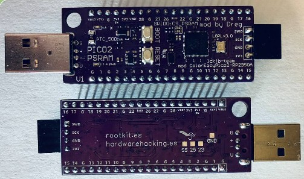
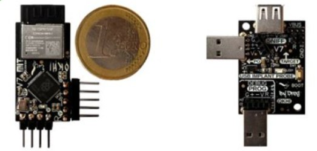
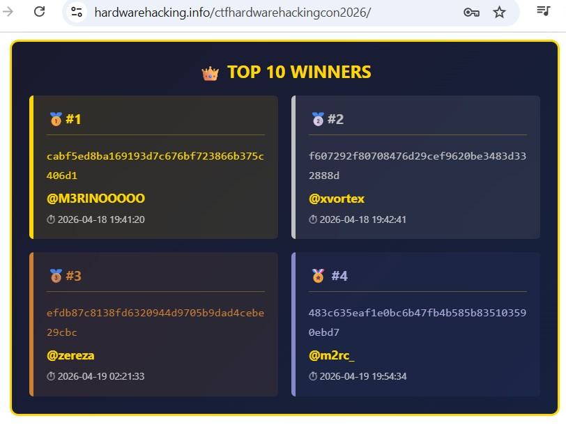
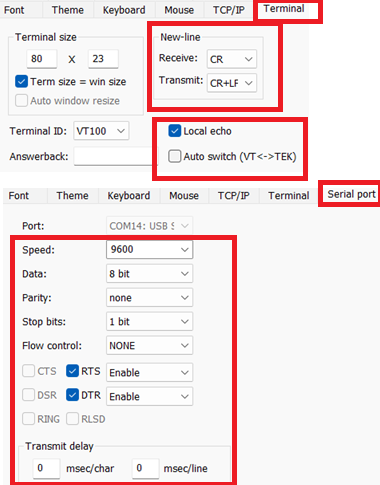

# Hardware Hacking CTF HardwareHackingES CON 2026 - RISCV Hazard3 (@Wren6991) Exploiting by @b1n4ri0 & @therealdreg

[https://hardwarehacking.es/](https://hardwarehacking.es/)

CTF LIKE: [https://github.com/therealdreg/hcon2026hwctf](https://github.com/therealdreg/hcon2026hwctf)



NOTE: THE CTF FIRMWARE ONLY WORKS ON DREG'S PICO2 PSRAM BOARD (RP2354A + PSRAM 64 Mbit APS6404L-3SQR-ZR)

-----

If you want to run the CTF **at home**, grab a **RP2350/RP2354** board with PSRAM 64 Mbit -> GPIO0, flash this firmware, and **don’t read the write-ups**! -> [ctf.uf2](ctf.uf2)

----

When you finish this CTF, if you liked it, here’s another similar one with different challenges: https://github.com/therealdreg/hcon2026hwctf/


# Write-ups

Prize: okhi hardware keylogger USB kit https://github.com/therealdreg/okhi



**WARNING**: The following write-ups contain spoilers for the challenges. If you want to solve them on your own, we recommend not reading them until you have completed the CTF.



-----

**First** Winner: **@M3RINOOOOO** (Cristóbal Merino Sáez) [writeups/first_winner.md](writeups/first_winner.md)

- https://x.com/Cristobalmer_02
- https://www.linkedin.com/in/cristobal-merino-saez-6868b5257

-----

**Second** Winner: **@xvortex** (Diego Soria Ruiz) [writeups/second_winner.md](writeups/second_winner.md)

- https://x.com/diegoxoria
- https://www.linkedin.com/in/diego-soria-ruiz/

-----

**Third** Winner: **@zereza** (Miguel Peñaranda Padilla) [writeups/third_winner.md](writeups/third_winner.md)

- https://x.com/mzereza
- https://www.linkedin.com/in/miguel-t-pe%C3%B1aranda-padilla-227076372

-----

**Fourth** Winner: **@m2rc_** (Marc Barrantes) [writeups/fourth_winner.md](writeups/fourth_winner.md)

- https://x.com/m2rc_p
- https://www.linkedin.com/in/marc-barrantes-847027253/

------

# TeraTerm / USB SERIAL COM CONFIG

For everything to work properly, you need to configure Tera Term / your COM USB serial app like this:

 

## GUI For Linux - cutecom

Install cutecom with your system package manager

```bash
sudo apt-get update
sudo apt-get install cutecom
```

# Note
This documentation is a summary of the content present in the repository [https://github.com/therealdreg/hcon2026hwctf](https://github.com/therealdreg/hcon2026hwctf); the objective of this document is to consolidate the relevant information needed to solve the challenge. Essentially, compatible material has been reused. Any additional questions or errors not covered within these repositories can be asked in the event's Telegram group [https://t.me/hardwarehackinges2026](https://t.me/hardwarehackinges2026) (Questions related to the functioning of the tools used to solve the challenge, not about the challenge itself).

# Dumping RP2350 firmware using picotool

Dumping firmware from RP2350 devices with `picotool` is a straightforward process.

Note: `picotool` interacts with RP2350 (and RP2040) devices only when they are in BOOTSEL mode or if the running firmware includes USB stdio support from the Pico SDK.

## Using pre-built binary

If you prefer to skip the build process, you can download the precompiled binary from the [official repository](https://github.com/raspberrypi/pico-sdk-tools/releases).

```bash
gunzip picotool-2.2.0-a4-x86_64-lin.tar.gz
tar -xf picotool-2.2.0-a4-x86_64-lin.tar
cd picotool
```

Running `picotool version` should work as expected:

```bash
$ ./picotool version
picotool v2.2.0-a4 (Linux, GNU-11.4.0, Release)
```

## Enable BOOTSEL mode on RP2350

To perform operations like dumping firmware, `picotool` requires the device to be in BOOTSEL mode. However, `picotool` can also interact with the device if the currently running firmware includes USB stdio support from the Pico SDK.

If your board **is not in BOOTSEL mode**, but contains the USB stdio support, you will see an output like this when trying to execute `picotool` commands:

```bash
$ ./picotool info
No accessible RP-series devices in BOOTSEL mode were found.

but:

RP2350 device at bus 1, address 23 appears to have a USB serial connection, so consider -f (or -F) to force reboot in order to run the command.
```

### Physically enabling BOOTSEL

This is the standard hardware method used:

1. Press and hold `BOOTSEL` button.
2. Press and release `RESET` or `RST` button.
3. Release `BOOTSEL`.

## Dump RP2350 firmware

For this CTF challenge, we can extract the firmware directly without entering in BOOTSEL mode.

Create a directory to store the extracted files.

```bash
mkdir -p $HOME/hwctf/
```

Run the following command to extract the firmware:

```bash
./picotool save -pvf -t bin $HOME/hwctf/hello_usb.bin
```

You should get an output like this:

```bash
$ ./picotool save -pvf -t bin $HOME/hwctf/hello_usb.bin
Tracking device serial number XXXXXXXXXXXXXXXX for reboot
The device was asked to reboot into BOOTSEL mode so the command can be executed.

Saving file:          [==============================]  100%
Wrote 73040 bytes to /home/b1n4ri0/hwctf/hello_usb.bin
Verifying Flash:      [==============================]  100%
  OK

The device was asked to reboot back into application mode.
```

And that's it, you have successfully dumped the program!

If you encounter errors, verify that the device is properly connected. If the automatic reboot fails, manually enter BOOTSEL mode and run the command again without the `-f` flag. For more information about available options, simply run `picotool help <command>`.

# Reversing RISC-V Hazard3 Firmware with Ghidra
Once the RP2350 firmware has been extracted, the next logical step is reverse engineering. For this task, we recommend using Ghidra. However, certain adjustments are required to ensure an accurate analysis.

## Patching Ghidra for Hazard3 Support

To achieve correct disassembly, you must update Ghidra's processor definitions to the ratified v1.0.0 spec.

First, locate your Ghidra installation path (e.g., `~/ghidra_12.0_PUBLIC`). Navigate to the RISC-V processor directory and rename the existing `data` folder as a backup:

```bash
export GHIDRA_INSTALL_DIR=~/ghidra_12.0_PUBLIC

cd $GHIDRA_INSTALL_DIR/Ghidra/Processors/RISCV 

mv data data_back
```

Next, clone the repository containing the updated instruction definitions and move the new `data` folder into your Ghidra installation:

```bash
cd $HOME
git clone https://github.com/therealdreg/hcon2026hwctf.git

cp -r hcon2026hwctf/RVGhidraImpl/data $GHIDRA_INSTALL_DIR/Ghidra/Processors/RISCV/
```

## Configuring the Analysis Environment

With the patched processor definitions in place, follow these steps to load the binary correctly:

1. Launch `PyGhidra`.
2. Create a new `Non-Shared Project` (e.g., `hwctf2026`).
3. Drag and drop the binary into the `Active Project` window.
4. Click the **"..."** button in the `Language` field.
5. In the filter box, type `RISCV` and select: `RISCV:LE:32:default:gcc` (RISCV default 32 little gcc).
6. Confirm with `Ok`.
7. Double-click the binary icon to open the `CodeBrowser`.
8. When prompted to analyze the binary, select `No`.

## Automated Setup

The `hcon26_rp2350-ctf_auto_setup.py` script is designed to automate the initial configuration and static analysis environment for firmware targeting the Raspberry Pi RP2350 (RISC-V Hazard3 core). This tool is specifically developed to support the reverse engineering tasks associated with the [**H-Con 2026 Hardware Hacking Challenge**](https://github.com/therealdreg/hcon2026hwctf).

Raw binary firmware inherently lacks the file headers and symbol tables required for automatic loading. This forces analysts to manually configure memory maps, entry points, and processor states before any code becomes readable. This tool automates that entire process, instantly preparing the binary for reverse engineering.

## Installation

1. Download this repository or the `con26_rp2350-ctf_auto_setup.py` file directly.

```bash
git clone https://github.com/therealdreg/hcon2026hwctf.git
```

2. Copy the script file into the `ghidra_scripts` directory of your Ghidra installation.

```bash
cd hcon2026hwctf/GhidraScripts

cp hcon26_rp2350-ctf_auto_setup.py $GHIDRA_INSTALL_DIR/Ghidra/Features/PyGhidra/ghidra_scripts
```

## Usage

1. Import the target `.bin` file into Ghidra (RV32).

2. Open the file in the `Code Browser`.

3. When prompted to analyze the file, select `No`.

4. Open the Script Manager `Window > Script Manager`.

5. Search for `hcon26_rp2350-ctf_auto_setup.py` located in the `RP2350` category.

6. Run the script and wait for the console output to confirm completion. Be sure to read the `Next Steps` information displayed in the console.

7. After the setup script finishes, execute the **RP2350 SVD Loader** to map hardware registers and peripherals.


# Load Peripherals

In order to load the peripherals you can use the GhidraSVD plugin developed by @antoniovazquezblanco
[https://github.com/antoniovazquezblanco/GhidraSVD](https://github.com/antoniovazquezblanco/GhidraSVD) 

And use the rp2350 svd file.

* Official RP2350 SVD file: [https://github.com/raspberrypi/pico-sdk/blob/master/src/rp2350/hardware_regs/RP2350.svd](https://github.com/raspberrypi/pico-sdk/blob/master/src/rp2350/hardware_regs/RP2350.svd)

# Detecting pico-sdk Functions in Ghidra

After configuring Ghidra and disassembling the binary, the next objective is to distinguish the challenge's specific functions from those belonging to the SDK.

Typically, the standard tool for this task is **Ghidra FID (Function ID)**. The workflow involves compiling SDK examples with the same configuration as the target binary to generate an FIDB database, this allows Ghidra to identify and name functions automatically. However, FID has a significantly low recognition rate in this case.

To overcome this limitation, we will use **BSim**. While other alternatives like **Version Tracking** or **Ghidriff** exist, they are primarily designed for comparing changes between versions (patch diffing) and are not as effective for this specific purpose.

## Preparing Reference Binaries from pico-examples

For Ghidra to identify functions via comparison, we must first generate a reference database by compiling the pico-sdk examples. If you want to optimize your time, you can focus on the four essential binaries mentioned at the end of this section.

Clone the official examples repository:

```bash
git clone https://github.com/raspberrypi/pico-examples.git
cd pico-examples
mkdir build
cd build
```
### Raspberry Pi Pico Extension

To use these paths, the Raspberry Pi Pico VS Code extension must be installed. These directory structures are native to the extension's environment.

Once the extension is installed, configure your project selecting **Board Type: Pico 2** and **Architecture (pico2): RISC-V** architecture. Simply creating the project with these settings will trigger the installation of all necessary resources. No additional compilation is required for this case.

We will use a specific configuration for the RP2350 Hazard3, ensuring that symbols and formatting match the challenge binary.

```bash
export PICO_SDK_PATH="$HOME/.pico-sdk/sdk/2.2.0"
export PICO_TOOLCHAIN_PATH="$HOME/.pico-sdk/toolchain/RISCV_ZCB_RPI_2_2_0_3"
```

```bash
cmake -DPICO_PLATFORM=rp2350-riscv \
      -DPICO_BOARD=pico2 \
      -DPICO_COMPILER=pico_riscv_gcc \
      -DCMAKE_BUILD_TYPE=Debug \
      -DPICO_DEFAULT_BINARY_TYPE=copy_to_ram \
      -DPICO_STDIO_USB=1 \
      -DPICO_STDIO_UART=0 \
      -DCMAKE_C_FLAGS="-march=rv32ima_zicsr_zifencei_zba_zbb_zbs_zbkb_zca_zcb_zcmp -mabi=ilp32 -O0 -g3 -fno-omit-frame-pointer -fno-lto" \
      -DCMAKE_EXE_LINKER_FLAGS="-Wl,--print-memory-usage" \
      ..
```

```bash
make -j$(nproc) -k
```

Once compilation is complete, group all `.elf` files into a dedicated directory for easier analysis:

```bash
mkdir ../sdk-elfs
find . -name "*.elf" -exec cp --backup=numbered {} ../sdk-elfs/ \;
```

### Automated Analysis with Ghidra Headless

To process the large volume of generated files, using Ghidra's headless mode is most efficient. Ensure you run the analysis pointing to the project where you have already configured the challenge binary:

```bash
# Run $GHIDRA_INSTALL_DIR/support/analyzeHeadless to check the usage
$GHIDRA_INSTALL_DIR/support/analyzeHeadless $HOME/hcon2026hwctf hwctf2026 -import pico-examples/sdk-elfs -recursive -processor "RISCV:LE:32:default"
```

If you prefer to reduce analysis time, process at least these four files, which contain the majority of the SDK functions present in the challenge:

* `tinyusb_dev_cdc_msc.elf`
* `multicore_runner_queue.elf`
* `hello_gpio_irq.elf`
* `hello_timer.elf`

## Analysis with BSim

When traditional signature identification (FID) is insufficient, BSim is the most powerful alternative. Unlike other methods, BSim is based on code behavior and structure, allowing for cross-architecture comparisons and ignoring variations caused by optimization levels.

### BSim Database Configuration

Although the GUI can be used, performing the configuration via terminal is more efficient for processing multiple binaries.

```bash
cd $GHIDRA_INSTALL_DIR/support
```
Create the H2 database file:
```bash
# Run ./bsim to check the usage
./bsim createdatabase file:/<db_directory_path>/pico_db medium_nosize
```

Extract signatures from the binaries already analyzed in the Ghidra project:

```bash
mkdir ~/bsim_sigs
./bsim generatesigs ghidra:$HOME/hcon2026hwctf/hwctf2026 ~/bsim_sigs --bsim file:/<db_directory_path>/pico_db
```

Finish the process by committing the generated signatures to our database:

```bash
./bsim commitsigs file:/<db_directory_path>/pico_db ~/bsim_sigs
```

### Integration in Ghidra GUI

Once the database is created, link it to the Code Browser:

1. Go to the `BSim > Manage Servers` tab.
2. Click the `green "+" icon` and select the `File` type.
3. Browse and select the database you just created.
4. Click `Dismiss` to close the window.

### Function Identification

There are several ways to search for matches with BSim, the following is most recommended:

* In the decompiler panel, right-click on the **Function name**, `BSim > Search functions`.
* If you get no results, select the bottom option in the BSim menu to open the settings dialog. Here, you can reduce the `Similarity Threshold` to find functions that have undergone slight variations during compilation.

**Tip**: If you are certain a function is correct, but its internal ("child") functions remain unnamed, use the BSim results window:

* Select the parent function and press `Shift + C` to open the comparison.
* Right-click and select `Compare matching callees`.
* Rename it with the correct signature.

## Analysis with Version Tracking

If the BSim option does not suit your needs, you can use **Version Tracking**.

### Creating the Session

In the main Ghidra window, locate the `blue footprints icon` on the far right of the `Tool Chest` to open the Version Tracking tool.

1. Click the `blue footprints icon` in the top-left menu to create a new session.
2. Assign a descriptive name (e.g., `tinyusb_dev_cdc_msc`).
3. Select the SDK ELF file as the source.
4. Select the challenge binary as the destination.
5. Proceed through the precondition checks. You can ignore minor warnings as long as no critical errors occur. Click `Finish`.

### Running Correlators

Three windows will open: Source Tool, Destination Tool, and the Version Tracking console.
In the Version Tracking window:

1. Click the `green "+" icon` (Add additional correlations).
2. Select all available correlators. While some may seem redundant, allowing Ghidra to run them all maximizes the chances of success.
3. Keep the default configuration values; you can adjust them in later sessions if you require higher precision.
4. Click `Finish` and wait for the process to conclude. Generally, BSim-based algorithms will offer the most robust results.

### Validation Strategies

Once Version Tracking results are obtained, there are two primary methodologies for applying changes to the challenge binary:

1. Manual analysis of each match to ensure high precision.
2. Automated acceptance of functions that exceed a specific confidence level, performing manual review only on doubtful results.

To implement the second strategy, it is essential to filter the results to focus on the strongest matches:

* In the `Filter` search bar, type "Function" to display only function correlations.
* **Technical Recommendation:** It is suggested to bulk-accept functions with a confidence score above **0.8**, always verifying the algorithm used for correlation.

### Applying Matches

To confirm and transfer the names to the destination binary, use the `green tick icon` (located between the flag and disk icons).

### Analysis Tips

* It is common to find conflicting functions. In these cases, ignore the automatic assignment and manually validate that the definitions are consistent with the challenge context.
* Try to resolve everything in a **single session**. If that is not possible, create independent sessions for different SDK ELFs and apply changes incrementally.
* If you identify a function with total certainty but the correlators fail to detect adjacent functions, check their location in the original ELF file. Due to the build structure, it is highly likely that the function you are looking for is located at a similar relative address in the challenge binary.

Depending on your analysis style, you can opt for two approaches:

1. Start directly with the reverse engineering of `main`. As you encounter unknown functions, use **BSim** to identify them.
2. Apply **FIDB** first to establish basic functions, then run **Version Tracker** with the BSim correlator to name the entire SDK at once.
  * [FID Tutorial](https://www.tarlogic.com/blog/esp32-firmware-using-ghidra-fidb/)

Choose the method that works best for you.

More information about BSim:
* [BSim Tutorial](https://ghidra.re/ghidra_docs/GhidraClass/BSim/README.html)